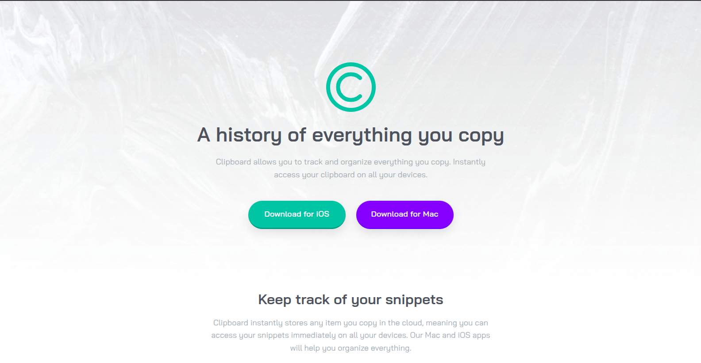

# Frontend Mentor - Clipboard landing page solution

This is a solution to the [Clipboard landing page challenge on Frontend Mentor](https://www.frontendmentor.io/challenges/clipboard-landing-page-5cc9bccd6c4c91111378ecb9). Frontend Mentor challenges help you improve your coding skills by building realistic projects.

## Table of contents

- [Overview](#overview)
  - [The challenge](#the-challenge)
  - [Screenshot](#screenshot)
  - [Links](#links)
- [My process](#my-process)
  - [Built with](#built-with)
  - [What I learned](#what-i-learned)
  - [Continued development](#continued-development)
  - [Useful resources](#useful-resources)
- [Author](#author)
- [Acknowledgments](#acknowledgments)

## Overview

### The challenge

Users should be able to:

- View the optimal layout for the site depending on their device's screen size
- See hover states for all interactive elements on the page

### Screenshot



### Links

- Solution URL: [github.com/Emmanuel-Xs/clipboard-landing-page-master](https://github.com/Emmanuel-Xs/clipboard-landing-page-master)
- Live Site URL: [clipboard-landing-page-master-rust.vercel.app](https://clipboard-landing-page-master-rust.vercel.app/)

## My process

### Built with

- Semantic HTML5 markup
- CSS custom properties
- Flexbox
- CSS Grid
- Mobile-first workflow

### What I learned

To make sure the desktop image is fixed to the left of the page at tablets and desktop screen sizes i made use of named grid lines for entire page and subgrid for the `body` children.

```css
body {
  display: grid;

  grid-template-columns:
    [page-start]
    minmax(var(--gutter), 1fr)
    [content-start]
    minmax(0, calc((min(100% - var(--gutter) * 2, 90rem)) / 2))
    [content-half]
    minmax(0, calc((min(100% - var(--gutter) * 2, 90rem)) / 2))
    [content-end]
    minmax(var(--gutter), 1fr)
    [page-end];
}

.main {
  & > * {
    grid-column: content;
  }
}

footer {
  & > * {
    grid-column: content;
  }
}
```

Also with the help of `subgrid` the `tools-grid` contents i.e `tools-item` is properly aligned from the image down to the heading and text.

checkout the code below

```css
.tools-grid {
  display: grid;
  grid-template-columns: 1fr;
}

.tool-item {
  grid-row: span 3; /* tells the subgrid how many rows to take*/
  text-align: center;
  display: grid;
  grid-template-rows: subgrid;
}
```

### Continued development

I would love to be able to build more stuffs with grid and flexbox, I want to assimilate the knowledge I learnt about them through projects I do.

### Useful resources

- [Simple CSS SUBGRID Tricks to Solve Real-Life Layout Challenges by Optimistic Web](https://youtu.be/hkdc_qBgXDc?si=B83kZztp4p6AMuCr) - This YouTube tutorial helped me in learning how to use subgrid to get the perfect aligned contents of a grid item.
- [Why you should start using NAMED GRID LINES in your CSS](https://youtu.be/zW9AQiCTg14?si=WIcxfTnb4grCn8DL) - A YouTube tutorial by the same person which me helped with implementing the named grid lines.

## Author

- Frontend Mentor - [Emmanuel-Xs](https://www.frontendmentor.io/profile/Emmanuel-Xs)
- Twitter - [xs_emmanuel](https://x.com/xs_emmanuel)

## Acknowledgments

Thanks to [Optimistic Web](https://www.youtube.com/@OptimisticWeb) for his wonderful tutorials which helped me a lot in this projects and all other wonderful YouTubers whom I learnt to Code
